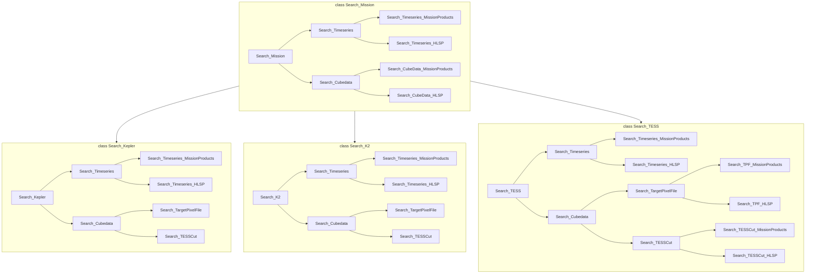

# Search package for finding and retrieving TESS/Kepler/K2 mission data
This package is a stand-alone implementation of the lightkurve search functionalty modernized for the 2024 data environment.  

## Changes Include:
  - This redevelopment uses pandas dataframs as the back-end for storing search results and mission tables.
  - Its cloud-first, defaulting to retrieve mast products from aws buckets where available, and returning S3 bucket URI's as part of the table results.
  - We've replaced the TESScut search functionality querying MAST FFI products and constructing a sector list) with a tesswcs implementation to identify observed sectors
  - We've unified TESSCut and TargetPixelFile search functionality into search_cubedata,  search_lightcurve has been renamed search_timeseries for thematic resonance.
  - we've deprecated download_all, just use download. it wraps download_one.  
  - TBD - replace astrocut TESScut api query with a URL based API Query?
  - (Not Yet Implemented) The intent is to include additional memmory caching options (not implemented yet) , and potentially cacheless options.

## Usage
  from newlk_search import search
  result = search.search_cubedata("KIC 11904151", mission="Kepler", cadence="long")

  result = search.search_timeseries("297.5835, 40.98339", quarter=6, author="Kepler")
  
  result.download()

  ## Documentation 
  this should probably exist

  ## Contact
  Please Don't

Mermaid Test

